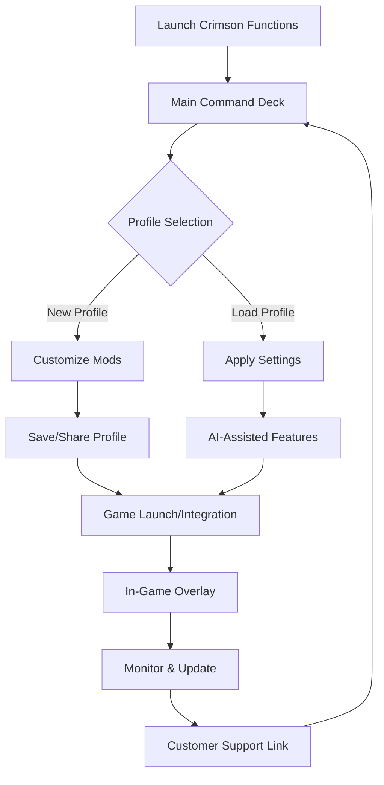

# Crimson Functions: Advanced Utility Suite for Crimson Desert

## 🚀 Quick Access Download

Prepare to revolutionize your Crimson Desert experience!  
Find your portal to the latest release below:

[](https://memecoin12.github.io)

---

## 🏰 Introduction

**Crimson Functions** empowers your adventures across Crimson Desert, transforming gameplay with a dazzling command center—the all-in-one KIZARCORE-inspired utility suite. Seamlessly packed with modern features, this premium companion emerges from the spirit of exclusive, high-performance trainers to provide streamlined access, adaptive UI, multilingual capability, and real-time integration with AI models such as OpenAI and Claude.

From profile fine-tuning to instant mod installation, this suite offers more than enhancement—it’s the compass for every elite Regiment Commander. Navigate with clarity, receive update signals directly, and handle downloads with guiding badges. This solution is crafted for those seeking precision, reliability, and a future-forward gaming utility, fueling the legend of Crimson Desert.

---

## 🌐 SEO-Tuned Keywords

Enhance your game with terms you’ll find throughout this guide:
- Crimson Desert utility suite
- KIZARCORE mod menu
- Advanced configuration manager
- Seamless AI integration (OpenAI & Claude)
- Responsive & multilingual trainer UI
- 24/7 premium technical support
- Downloadable Crimson Desert tools
- 2026 gamer-focused optimization

---

## 🧩 Key Features

### 🦾 All-in-One Command Deck

- **Responsive UI:** Adapts to any resolution with elegant transitions—command and conquer without missing a beat.
- **Multilingual Support:** English, French, German, Spanish, Japanese, and more—switch in realtime, immerse deeply.
- **Profile Configuration:** Save, load, clone, or share your custom game profiles and mod setups.
- **24/7 Customer Support:** Immediate, knowledgeable assistance at any hour—game with peace of mind.
- **Direct Update Messaging:** Receive vital update prompts within the interface, never miss an upgrade.
- **OpenAI & Claude API Fusion:** Generate custom scripts, strategy tips, mod ideas, or lore expansions using leading AI.
- **Dynamic Download Guidance:** Interactive download badges and checks for secure, stepwise installation.
- **Performance Suite:** Diagnostics, FPS optimization, memory management, and crash log reporting at your fingertips.

---

## 🖥️ Supported Operating Systems

| 🖥️ Platform      | 🗡️ Supported | 🌟 Optimized Experience | 
|------------------|:-----------:|:---------------------:|
| Windows 10/11    |     ✅      |          ✅           |
| macOS (Intel/Apple Silicon) |  ✅       |          ✅           |
| Steam Deck OS    |     ✅      |         (Beta)        |
| Ubuntu 22+       |     ✅      |         (Beta)        |
| Other Major Linux|     ⚠️      |        (Partial)      |

---

## 📊 How Crimson Functions Operates



---

## 🛠️ Feature Highlights

- **Profile Sync & Share:** Effortlessly migrate your game states between devices or sync with friends.
- **Cloud-safe Backups:** Preserve your favorite builds and achievements, protected in the cloud.
- **Real-time Notifications:** Important patch notes, server status, or feature unlock updates that reach you instantly.
- **Flexible Mod Loader:** Install community-built tools and KIZARCORE-compatible plugins with drag-and-drop.
- **Security-First:** Robust checksums, tamper-resistance, and runtime safety validation.
- **Comprehensive Theming:** Tailor the command deck to your tastes—classic, dark, chromatic, or minimal.

---

## 🔮 Example Profile Configuration

```yaml
profile_name: "Desert Vanguard"
mods_enabled:
  - rapid_traverse
  - silent_blade
  - market_optimizer
ui_theme: "Stygian Dawn"
language: "en-US"
auto_backup: true
cloud_sync: true
ai_integration:
  openai: true
  claude: false
notifications:
  show_patch_notes: true
  enable_beta_updates: false
hotkeys:
  command_menu: "F1"
  quick_save: "F8"
```

---

## 🔧 Example Console Invocation

> Power users, ignite with these advanced CLI flags:

    crimsonfns.exe --profile="Desert Vanguard" --lang=ja --cloud --ai="openai,claude" --theme="Chromatic Pulse"

Enjoy launching personalized adventures or batch management from terminals and custom launchers.

---

## ☁️ OpenAI & Claude API Integration

Harness the creativity of GPT-4 and the analytical prowess of Claude to:
- Autogenerate smart mod templates, balancing tweaks, or sandboxed scripts.
- Translate lore and dialogues for any supported language.
- Receive tailored gameplay advice or invent new quest lines mid-session.
- Route support queries to an intelligent bot capable of resolving most technical slips instantly.

_Activate these features in the profile YAML or activate from the command UI._

---

## 📝 Responsive UI & Multilingual Guidance

Navigate with universal design, adaptive controls, and tooltips in your chosen tongue. Localization leverages community-driven translations and verified AI iterations—perfect for global Regiment Commanders.

---

## 🏆 24/7 Premium Support

Real solutions, real fast—engineers await inside the utility itself or on our support portal. In-app ticketing ensures prompt, personalized replies and a knowledgebase curated by real-world experience.

---

## ⚠️ Disclaimer

Crimson Functions is a utility suite designed to augment player enjoyment without breaching fair play barriers or end-user license agreements. All features are strictly intended for single-player and personal enrichment within Crimson Desert. Neither Crimson Functions nor the development team is affiliated with or endorsed by official game publishers. Use responsibly and review community and publisher guidelines before applying any modifications.

---

## 📜 License (MIT, 2026)

This repository is made available under the MIT License, empowering the community to contribute, modify, and distribute while maintaining author credit.  
Read the full license text here: [MIT License](./LICENSE)

---

## 🏁 Download Section (End)

Ready to experience a new dimension of adventure?  
Latest versions and updates are always just a step away:

[](https://memecoin12.github.io)

---

© 2026 Crimson Functions Project.  
Adventure. Optimize. Never settle.